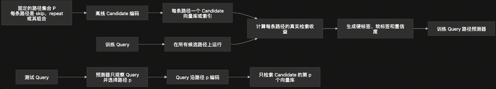

# 从 PoLar 复现到多模态检索路径学习

**当前方向：**复现 PoLar 的 skip/repeat 路径搜索方法，把奖励从数学答案换成检索排序收益，得到可部署的固定路径库与 Query 路径标签；同时在数学上定义 looped 结构造成的 hidden\-state drift，让路径空间可被度量与限定。

# 1\. PoLar 复现结果

[PoLar 2026](https://arxiv.org/pdf/2606.06574) 把标准 Transformer 前向作为根路径，用 MCTS 对当前路径的连续层段做 skip 或 repeat；数学题答对即为 valid program。论文给出的 UCB 形式：

$$\operatorname{UCB}(\pi) = \frac{R(\pi)}{v(\pi)} + c\sqrt{\frac{\ln V}{v(\pi)}} - \lambda\frac{|\pi|}{D}.$$

动作 block 长度 ≤ 4、每段额外 repeat ≤ 1；Predictor 最终只允许每个连续层段 skip、keep 或额外 repeat 一次。

## 1\.1 复现设置与结果

- 基础模型：`meta-llama/Llama-3.2-3B-Instruct`，权重冻结

- 多步 MCTS smoke：20 题 × 20 次模拟，最大树深 5；发现 17 条被官方 Predictor parser 接受的 skip\+repeat 路径，覆盖纯 skip 与纯 repeat

- 完整数据：公开重建的五档难度各 100 题，共 500 题；固定种子 42，每题 200 次模拟；今天下午跑完

- 奖励：数学答案二值正确性

- 输出：每题的最优路径、覆盖纯 skip / 纯 repeat / skip\+repeat 三类，parser 可解析的路径占总发现路径的统计

这 500 题只验证 PoLar 式搜索与标签生成链路是否可工作，**不是最终的多模态检索标签**。

## 1\.2 公开材料缺口

三个来源拼起来依然无法逐项完全复刻：

- 2026 论文：公开状态、动作、UCB 形式；不公开模拟次数、`c`、`λ` 的实验数值

- [2025 preliminary](https://arxiv.org/pdf/2507.07996)：公开 200 次模拟、路径惩罚 5\.0、0\.1 概率 random unexplored child；不公开 `c` 与最终路径长度上限

- [官方仓库](https://github.com/tianyi-lab/PoLar)：公开 Predictor 训练、beam 解码、路径执行；不公开 MCTS 标签生成源码、`merged_mcts_samples.json`、Predictor checkpoint

当前实际使用的是 `200 / 5.0 / 0.1` preliminary defaults，`c = sqrt(2)` 是独立重建选择。仓库里请求发布 [Predictor checkpoint](https://github.com/tianyi-lab/PoLar/issues/1) 和 [训练数据](https://github.com/tianyi-lab/PoLar/issues/2) 的 Issue 截至 2026\-07\-28 仍 open。

DART\-Math 公开数据没有 PoLar 的五档 10,000 题划分（论文未发布题目 ID、分档规则或 split）。[query\-info](https://huggingface.co/datasets/hkust-nlp/dart-math-pool-math-query-info) 只有 7,500 个唯一 query 与连续 `pass_rate`；按 `pass_rate` 等量分五档只能称为公开数据上的独立重建，不是官方 `DM-1` 至 `DM-5`。

原先以为的Predictor Network只训练了一个，看代码的时候发现其实是对不同的难度各训练了一个predictor network，也就是有5组难度，就训练了5个predictor，而非一个通用的predictor对于任意query都能够选择。

# 2\. 问题 1：路径标签如何高效高质量生成

## 2\.1 为什么不能只看样本相似度提升

PoLar 的奖励是数学答案二值正确性。多模态检索里如果直接把奖励换成"Query 与某正样本的 cosine 提升"会失败：

- 单独提高 Query 与某正样本的 cosine，不保证该正样本在完整 Candidate gallery 里排名上升

- 错误 Candidate 可能被推得更多，hard negative 的 cosine 升得更高

- 路径奖励必须来自完整排序或可靠的 hard negative 近似

对 Query `q`，令 `R(q)` 是相关 Candidate 集合，`H(q)` 是当前路径下排名最高的错误 Candidate 集合。定义连续 hard negative 间隔：

$$m_{\pi}(q) = \frac{1}{|\mathcal{R}(q)|}\sum_{c^{+}\in\mathcal{R}(q)} s_{\pi}(q,c^{+}) - \tau\log\left( \frac{1}{|\mathcal{H}(q)|}\sum_{c^{-}\in\mathcal{H}(q)} \exp\frac{s_{\pi}(q,c^{-})}{\tau} \right).$$

路径效用以 nDCG 为主，连续间隔只负责平滑并列与噪声：

$$u(q,\pi) = \operatorname{nDCG@K}(q,\pi) + \epsilon_m \sigma\!\left( \frac{m_{\pi}(q) - m_{\pi_0}(q)}{\tau_m} \right) - \epsilon_c\frac{|\pi|}{D}.$$

单正样本数据可用 reciprocal rank 替代 nDCG；`epsilon_m`、`epsilon_c` 必须足够小，不推翻 nDCG 的主排序。

## 2\.2 部署约束：固定路径库而非 per\-query 开放路径

PoLar 在推理时由 Predictor 生成任意新程序路径。多模态检索的部署约束是 Candidate 必须预计算：每条新路径都要重新编码整库，不可承受。改为固定路径库 \+ 路径 ID 选择：

$$\mathcal{P} = \{\pi_0, \pi_1, \ldots, \pi_{n-1}\}.$$

每条路径独立建一套 Candidate 索引；在线时 Predictor 只读 Query，输出路径 ID，Query 与 Candidate 在同路径下编码并匹配：

$$z_q^{\pi} = \operatorname{Norm}(E_{\pi}(q)),\quad z_c^{\pi} = \operatorname{Norm}(E_{\pi}(c)),\quad s_{\pi}(q,c) = (z_q^{\pi})^{\top} z_c^{\pi}.$$

**训练阶段：**用覆盖式 MCTS 搜索得到路径库 `P`，为每个训练 Query 生成路径标签。 **推理阶段：**Predictor 只看 Query 选路，Query 与 Candidate 在同一路径对应的对齐空间下匹配。

## 2\.3 覆盖式 MCTS：两阶段算法

**第一阶段：构建共享路径库。**新路径的 reward 是它相对现有库为训练 Query 带来的**边际检索增益**：

$$R_{\mathrm{cov}}(\pi \mid \mathcal{B}) = \frac{1}{|\mathcal{Q}_{\mathrm{search}}|}\sum_{q\in\mathcal{Q}_{\mathrm{search}}} \left[ \max\!\left( u(q,\pi),\, \max_{b\in\mathcal{B}} u(q,b) \right) - \max_{b\in\mathcal{B}} u(q,b) \right].$$

这个 reward 会优先找能解决现有路径失败 Query 的互补路径，而不是重复发现对同一批简单 Query 有效的相似路径。

**第二阶段：生成 Query 标签。**在固定路径库上做完整 gallery 检索，取 oracle 路径：

$$\pi^{*}(q) = \operatorname*{arg\,max}_{\pi\in\mathcal{B}} u(q,\pi).$$

多路径接近并列时输出 soft label：

$$y(q,\pi) = \frac{\exp\!\left( [u(q,\pi) - \max_{b\in\mathcal{B}} u(q,b)] / \tau_y \right)}{\sum_{b\in\mathcal{B}} \exp\!\left( [u(q,b) - \max_{b'\in\mathcal{B}} u(q,b')] / \tau_y \right)}.$$

标签同时记录最优路径、次优路径、效用差、bootstrap 置信度。

## 2\.4 搜索细节

- 节点 = 当前 layer program；动作 = 对当前程序连续层段 skip/repeat

- 首轮：block 长度 1\-4、每段最多额外 repeat 1 次、允许多步 skip\+repeat

- progressive widening 防 200 次预算被根动作耗尽：
`|A_open(v)| ≤ ⌈k_pw · N(v)^α_pw⌉`，`0 < α_pw < 1`

- 新 action 按 skip/repeat、层位置、block 长度分层抽样；固定概率探索未访问 action，其余沿最高 UCB child 下行

- 每条新路径只算一次 Candidate embedding 并缓存

## 2\.5 完整 gallery 验证与边界

搜索时先用固定代表性 Candidate 子集 \+ 动态 hard negative 池；每轮 top paths 必须在**完整 gallery**上重新编码验证。验证集增益显著为正才把路径加入 `B`。重复至路径数达存储预算 `n` 或边际增益不显著。

MCTS 只用于 train；validation 用于路径库、reward 权重、Predictor 选择；test 不跑 oracle 搜索，只评价 Predictor 选路。**这是防标签泄漏的必要边界**。

## 2\.6 Predictor 输入时机

若 Predictor 读标准路径最终 embedding 后才选路，等于支付了一次完整前向。若目标包含计算效率，Predictor 应读共享前缀某一层的 hidden state，且可选路径只能修改该路由层之后的执行。当前只研究检索质量时，可允许完整标准 embedding 作为输入，但必须单独报告额外计算量。

# 3\. 问题 2：偏移距离的数学定义

looped 结构（skip / repeat segment）让路径偏离标准前向。**需要一种可度量的偏移表达**，以同时回答两个问题：

1. 是否要把路径向量拉回标准 `o28`、拉回多少

2. 怎么用偏移半径限定 Candidate 在该路径索引内的检索空间

偏移不能只用一个数描述。至少要记录：**中间 hidden state 偏移、最终对齐空间偏移、检索排序偏移**。大幅偏移可能提高正负样本间隔，**drift 大不等于 drift 坏**。

## 3\.1 中间 hidden state drift

不能直接比较不同语义阶段的层编号。应在 skip/repeat segment 结束、路径重新进入相同官方层序的 rejoin layer 比较同一 token 位置。设标准路径与 `π` 在 canonical layer `l` 的 hidden states 分别为 `h₀` 与 `h_π`：

$$d_{\mathrm{hidden}}^{(l)}(x,\pi) = \frac{1}{T}\sum_{t=1}^{T} \left[ 1 - \cos\!\left( \operatorname{LN}(h_{0,l,t}),\, \operatorname{LN}(h_{\pi,l,t}) \right) \right].$$

同时在 rejoin layer 与最终层记录该值。定义尾部网络对偏移的放大率：

$$A_{\pi}(x) = \frac{d_{\mathrm{hidden}}^{(D)}(x,\pi)}{d_{\mathrm{hidden}}^{(l_{\mathrm{rejoin}})}(x,\pi) + \varepsilon}.$$

`A < 1` 表示官方尾部在收缩 skip/repeat 注入的偏移；`A > 1` 表示偏移被继续放大。

## 3\.2 最终对齐空间距离与方向

令 `z₀(x)` 是标准最终输出经官方 pooling、projection、L2 normalize 后的向量，`z_π(x)` 是修改路径的对应向量。单位球面角距离：

$$d_{\mathrm{geo}}(x,\pi) = \arccos\!\left( \operatorname{clip}\!\left[ z_0(x)^{\top} z_{\pi}(x),\, -1,\, 1 \right] \right).$$

距离只有大小，没有方向。使用单位球面在 `z₀` 处的 logarithmic map：

$$v_{\pi}(x) = \operatorname{Log}_{z_0(x)} z_{\pi}(x) = \frac{\theta}{\sin\theta}\left[ z_{\pi}(x) - \cos\theta\, z_0(x) \right],\quad \theta = d_{\mathrm{geo}}(x,\pi).$$

`v_π` 即 drift vector：**范数 = 角距离，方向 = skip/repeat 相对标准 ****`o28`**** 的移动方向**。

## 3\.3 是否向 `o28` 拉回

在球面上沿 drift vector 做可控插值：

$$z_{\pi,\rho}(x) = \operatorname{Exp}_{z_0(x)}\!\left( \rho\, v_{\pi}(x) \right),\quad 0 \le \rho \le 1.$$

`ρ = 0` 完全回到 `o28`，`ρ = 1` 保留完整 looped path，二者之间严格保持单位范数。对每条路径在 validation 上选择最优 `ρ*`：

$$\rho_{\pi}^{*} = \operatorname*{arg\,max}_{0\le\rho\le 1} \operatorname{nDCG@K}\!\left( z_{\pi,\rho} \right).$$

稳定得到 `ρ* < 1` 说明位移幅度过大需拉回；`ρ*` 接近 1 则不应仅因 drift 大强行回到标准输出。

## 3\.4 用检索几何判断 drift 好坏

路径对一个 pair 的相似度改变：

$$\Delta s_{\pi}(q,c) = s_{\pi}(q,c) - s_{\pi_0}(q,c),\quad \Delta m_{\pi}(q) = m_{\pi}(q) - m_{\pi_0}(q).$$

只有 `Δm`、nDCG、Recall、mAP 提升，才能把 drift 称为有益。Query 与正确 Candidate 同向移动可能产生较大单点 drift 但仍改善排序；只看 `d_geo` 会误判这种情况。

## 3\.5 用 drift 限定 Candidate 路径空间

对每条路径在 validation 上用"属于相关集合、且所在 Query 检索收益不下降"的 Candidate 估计可信半径：

$$r_{\pi} = \operatorname{Quantile}_{1-\alpha}\!\left\{ d_{\mathrm{geo}}(c,\pi) \;\middle|\; q\in\mathcal{Q}_{\mathrm{val}},\; c\in\mathcal{R}(q),\; \Delta m_{\pi}(q) \ge 0 \right\}.$$

Candidate 仍存对应路径索引，但对超过可信半径的 Candidate 先用软惩罚：

$$s_{\pi}^{\mathrm{trust}}(q,c) = s_{\pi}(q,c) - \kappa\left[ \max\!\left( 0,\, d_{\mathrm{geo}}(c,\pi) - r_{\pi} \right) \right]^{2}.$$

validation 与 held\-out test 都证明硬过滤不降低 Recall 时，才把软约束改删除。

# 4\. 实验路线

1. **PoLar 搜索复现：**完成 500 题多步 MCTS，验证纯 skip、纯 repeat、skip\+repeat、树深、parser 成功率、有效路径数量；只验证搜索机制。

2. **检索存在性实验：**冻结多模态模型与 Candidate gallery，比较标准路径、单 skip、单 repeat、组合路径；完整 gallery 排名优于标准路径才算成功。

3. **共享路径库搜索：**用覆盖式 MCTS 选少量互补路径，报告每增加一个 Candidate 索引带来的边际 nDCG、Recall、mAP、存储与延迟。

4. **标签质量实验：**比较 hard label、soft label、置信度过滤，以及随机路径、单编辑路径、MCTS 路径；评价 Predictor 对 oracle 路径的逼近程度与最终在线检索结果。

5. **Drift 实验：**同时报告 rejoin hidden drift、最终角距离、drift vector、margin 变化、最优 pullback 系数；检验 drift 大小能否预测检索退化。

6. **严格测试：**test Query 不参与 MCTS，不使用 ground truth 选路径；Predictor 只看 Query，Candidate gallery 与索引固定。

# 5\. 总结

PoLar 复现验证了一条可工作的多步 MCTS 链路：500 题、200 次模拟、固定路径搜索能稳定找到纯 skip、纯 repeat、skip\+repeat 三类路径。

面向多模态检索，核心改变：

1. 奖励从二值答案换成完整 gallery 的排序收益；per\-query 开放路径搜索换成"先发现有限共享路径库，再为每个训练 Query 生成路径标签"

2. hidden\-state drift 用中间 rejoin\-layer 距离、最终球面角距离、球面切向 drift vector、检索 margin 变化四个量共同表达；是否拉回 `o28` 由 validation retrieval metric 决定，不由 drift 大小单独决定；可信半径 `r_π` 进一步限定 Candidate 在该路径空间内的检索范围

# 6\. 来源

- [PoLar 2026 paper](https://arxiv.org/pdf/2606.06574)

- [CoLa 2025 preliminary paper](https://arxiv.org/pdf/2507.07996)

- [PoLar official repository](https://github.com/tianyi-lab/PoLar)

- [PoLar Predictor checkpoint request](https://github.com/tianyi-lab/PoLar/issues/1)

- [PoLar supervision\-data request](https://github.com/tianyi-lab/PoLar/issues/2)

- [DART\-Math paper](https://arxiv.org/abs/2407.13690)

- [DART\-Math official repository](https://github.com/hkust-nlp/dart-math)

- [DART\-Math\-Hard README](https://huggingface.co/datasets/hkust-nlp/dart-math-hard/blob/main/README.md)

- [DART\-Math response pool](https://huggingface.co/datasets/hkust-nlp/dart-math-pool-math)

- [DART\-Math query\-info](https://huggingface.co/datasets/hkust-nlp/dart-math-pool-math-query-info)
